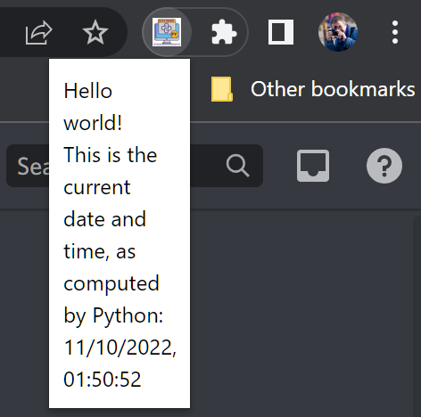

# PyScript Local Runtime Downloader & Web App

This project sets up a **local PyScript runtime environment** by downloading all required Pyodide and PyScript files, and provides a front-end web interface that can function like a weather-style browser extension or local HTML app.

---

## 🚀 Features

- 📦 Downloads latest PyScript & Pyodide files locally
- 📄 Includes `setup.py` for automated download
- 🌐 Contains a PyScript-based `index.html` front-end
- 🧩 Chrome Extension support via `manifest.json`
- 🖼️ UI icon included (`popup.png`)
- 📝 Logs all downloads in `setup.log`

---

## 📁 Project Structure

```

pyscript-local-runtime/
│
├── runtime/
│   ├── \[Downloaded Pyodide & PyScript files]
│   ├── setup.py           # Python script to download runtime files
│   ├── setup.log          # Logs the download results
│   └── ...
│
├── index.html             # Main HTML app using PyScript
├── main.py                # Optional PyScript Python code
├── finished.js            # Optional JS logic after load
├── manifest.json          # Chrome extension manifest
├── popup.png              # Icon for the extension
└── README.md              # This file

````

---

## 🔧 Requirements

- Python 3.7+
- `requests` library

Install with:

```bash
pip install requests
````

---

## ⚙️ How to Run

### 1. 📥 Download PyScript Runtime

From the root directory:

```bash
cd runtime
python setup.py
```

All required files (JS, WASM, TAR, etc.) will be downloaded locally to the `runtime` folder.

---

### 2. 🌐 Run the App in Browser

Open `index.html` in any modern browser:

```bash
# Optionally use Live Server for auto-reload
Right-click > Open with Live Server (VS Code)
```

---

### 3. 🧩 Load as Chrome Extension (Optional)

1. Open Chrome and go to `chrome://extensions/`
2. Enable **Developer Mode**
3. Click **“Load unpacked”**
4. Select the project root folder
5. The extension will appear with your `popup.png` icon

---

## 📜 Logs

All download logs are saved in:

```
runtime/setup.log
```

You can inspect this for download status and errors.

---

## 📸 Screenshot



---

## 🧠 Credits

* [PyScript](https://pyscript.net)
* [Pyodide](https://pyodide.org)
* CDN via [jsDelivr](https://www.jsdelivr.com/)

---

## 🛡️ License

License – use freely, modify, and share.

```


